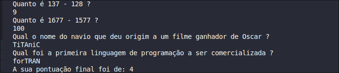

# Projeto de um Jogo de Perguntas e Respostas, usando C#

## Contexo

Projeto criado levando em consideração o curso "Curso C#" da danki code, tem como propósito solidificar meus conhecimentos em C#

## Explicação do Cógido:

O código é divido em 4 partes:

- Declaração de Variáveis
- Perguntas (com tratamento básico para string's)
- Parte lógica para soma do score
- Impressão do score

## Exemplo do Código em Funcionamento

